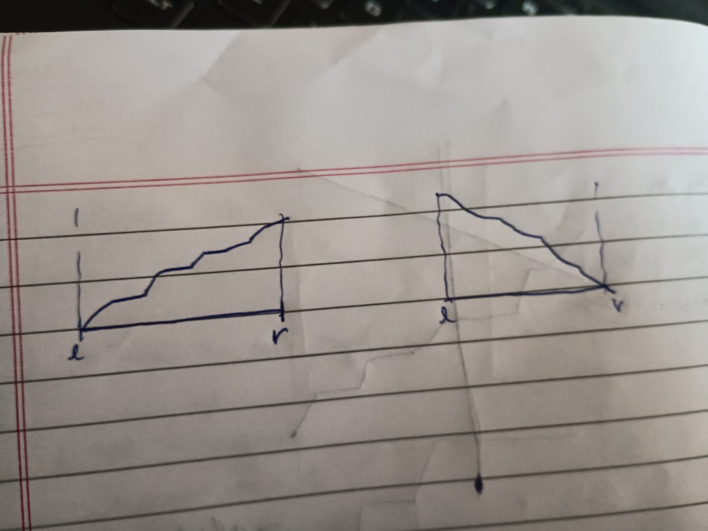

> usually used when there is a specific trend (increaseing/non decreasing , decreasing/non incresing) in values u r searching as some parameter increase or decreases. and wanna maximize or minimizethat thing u r searching given some parameter u r varying. tere might also be some range within which u need to keep ur thing that u r searching for.

# Bomb [https://codeforces.com/problemset/problem/1996/F]
- brute force be to use priority to get best answer for every k one by one.
- lets the element last going into the answer be x, observe that if x is high k reduced and if x is low k increases (specific trend). so we can search for mamimizing k over vrying paramter x.
- edge case handling = for (x-1) , keq>k but for (x) , keq'<k  , this happens because of values coming mutliple times , so in the end try forming  priority_queue after keq' and brute force the values to get answer. '
- when a=1 and b=1 and k=1e9, this will give tle at brute force so make sure to break when maximum adding value become 0.
- <mark>IMPORTANT= IN BINARY SEARCH IF ALL SEARCH FAILS MAKE SURE TO HAVE INITIALISED THE THING WHERE U WILL STORE ANSWER IN A SUCH A SUITABLE WAY THAT IT IS DEALT WITHp</mark>