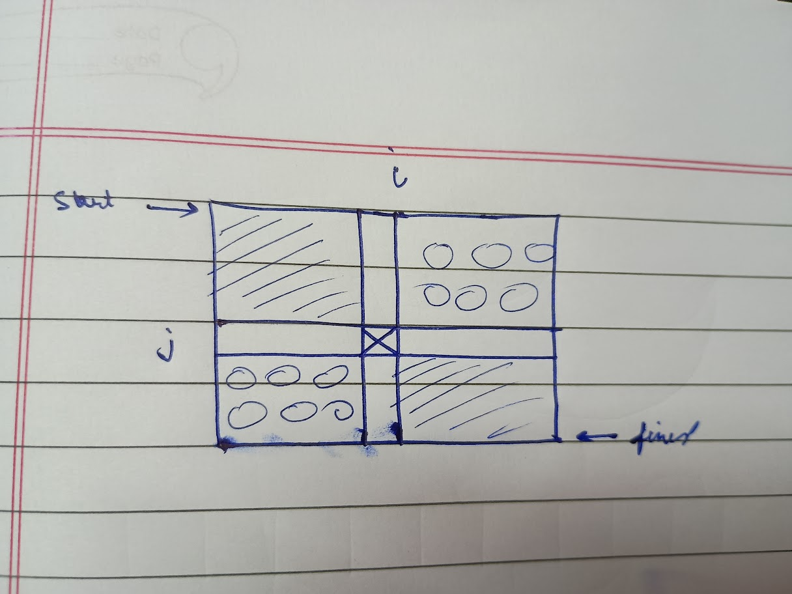

- in this type of problems grid is dynamic , that is it is changing (evven just a  single cell) wrt our choice of picking a path.

>https://codeforces.com/problemset/problem/2194/E

- here we cant use techinque used in static type as for use to deciding our choice from already solved points, they must have the same grid condition (in this question same wrt a particular sauce point, because the sauce point of 1 path may be also affecting the other , or not and we cant solve this problem with any other dp states )

- we must for each point where we sauce , determine the maximum path and select the smallest maximum path, naive approach tc-> n^2.m^2. we must optimized it.
- lets observe by that maximum path may or may not pass though sauce point.

- observe that if path if passes though sauce , it must pass though the shaded region and it is the same as maximim path from (0,0 to i,j  ;[forward]) and (n,m to i,j  ;[backwards]). so we can get answer for it as 
max(0,0->i,j)+max(m,n->i,j)-a[i][j];
- if it doesnt pass through sauce , it must pass though circled regions. and out of these points circled regions we have to take maimum of the path that passes though them (given maximum path for given sauce point). for a given point(a,b) not in sauce we just do max(0,0->i,j)+max(m,n->i,j) to get maxmimum path though it.
- so we jsut need to precompute the forward and backward maximum paths, for each point determe maximum path value passing though it.also use suitable prefixsum to efficient get the maximum from circled region