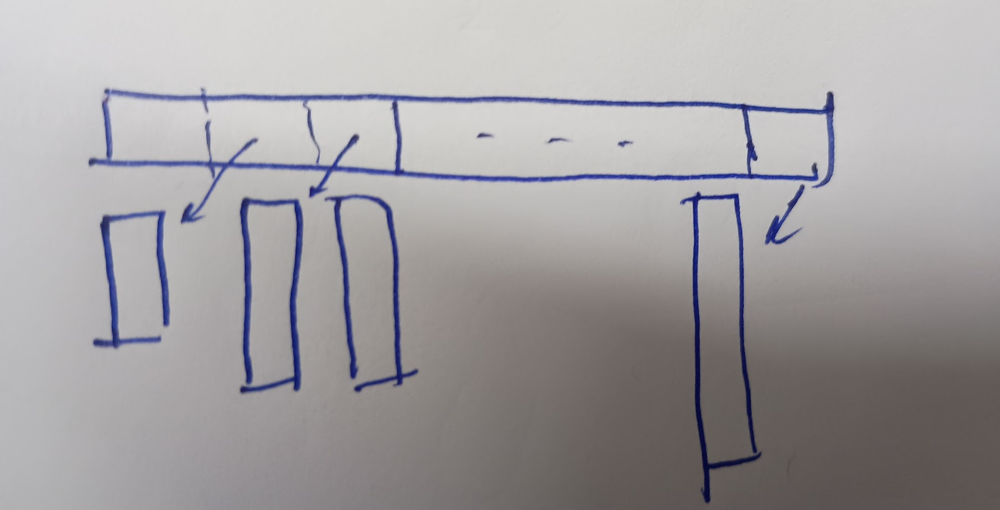
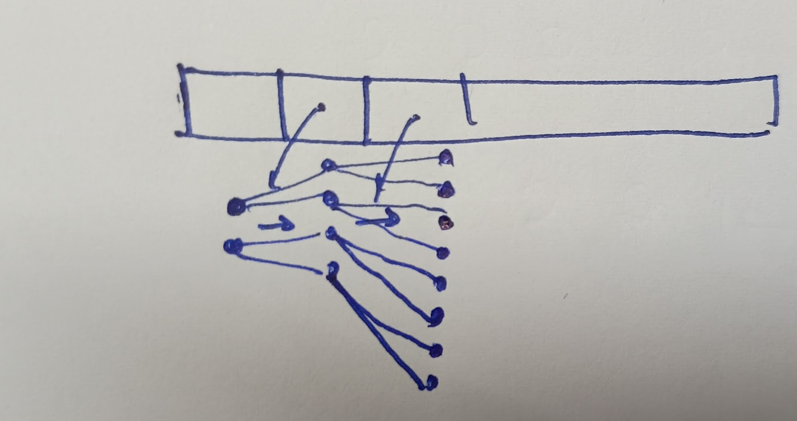
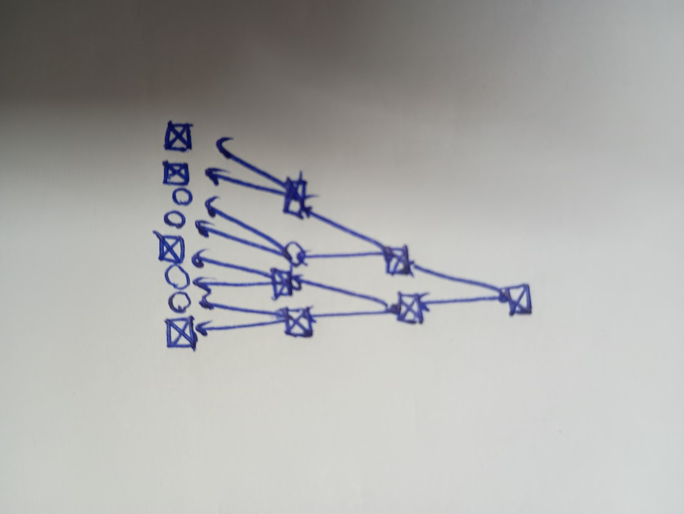

> types of questions similar to subarray sum equal to k (use of map to store previous sums(preffix sum))

# Valuable Cards [https://codeforces.com/problemset/problem/1992/F]
- here brute force way = iterate through all the previously stored elements and see if we get product x.if not store the new ones along with old ones (complexity around exponential {incearse in the lenght of prev by mutliplying by 2})
- but in brute for we r storing many useless values. NOTICE THAT ONLY DIVISORS OF X SHOULD BE STORED AS THEY ONLY CAN MUTLIPLE TO GIVE X.
- SO INSTEAD CHECK IF DIVSORS CAN BE ONLY FORMED OR NOT. this is a simple observation but makes it for n*(exponential) to n*d(x) where d is divisors of x
> use of concept of taking only important and useful data

to
