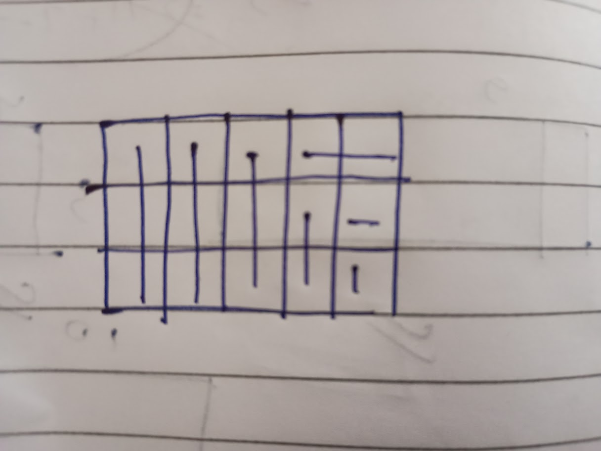

# Color Rows and Columns [https://codeforces.com/problemset/problem/2000/F]
- given n rectangles observe that lest say i took ai rows and bi columns from i rectangle and aj rows and bj rows from j rectangle for optimum solution, we cant greedily select it.
 - DP LOGIC-> to get optimal answer for points [0->k] from reactangle 0->i-1 and for optimal answer from points [0->k] including  ith recatngle , take possible points that u can take from the rectangle(some rows and some columns) and see where it can be used.
-WHAT I DID WRONG IN FIRST TRY->read the question wrong. the question required atleast k ,so observe that if only 1 square left , it will always contribute 2 points, hence in this question u can take 2 pts , 1 cost as == 1pts , 1 cost and 1pts ,0 cost.(wont affect for cases suuch that sum of pts less than k, and due to quesstion it satisfy end case where sum adding to greater than k )
-REMEMBER OPTIMAL WAY TO PAINT THE ROWS AND COLUMNS FOR MINIMUM COST PER PT.
