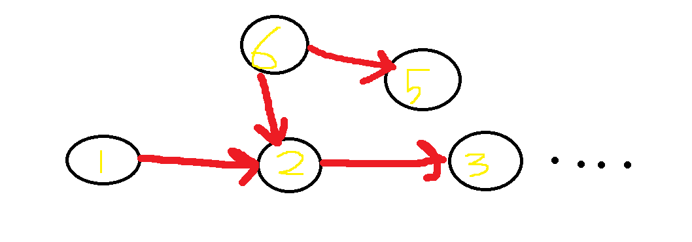

# Interactive Graph (Hard Version) [https://codeforces.com/problemset/problem/2196/C2]
- here observe that like below example when 6 paths come , first one to come will be 2 and after that all paths from 2 will come , no new information , so we can just store the number of paths 2 will have and increment idx (ptr which we will use to query) by it.

